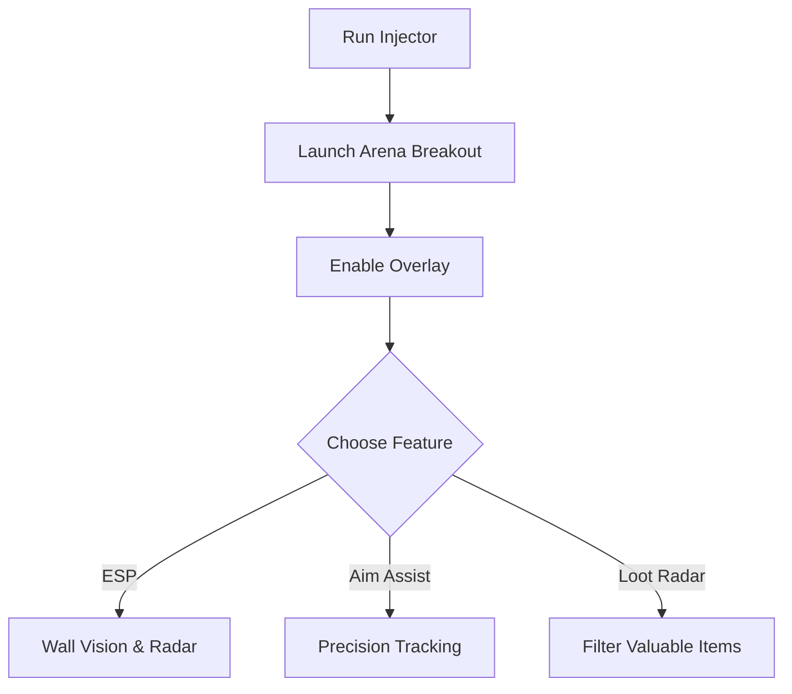

# Arena Breakout Cheat 👁

The **Arena Breakout Cheat Software** is a customizable PC tool created for players who want to boost **awareness, accuracy, and efficiency** in every raid. With overlays, aim modules, and loot filters, it transforms your training experience and tactical decision-making.

---

## 📝 Overview

Arena Breakout is unforgiving—every second counts. This cheat provides **ESP highlights**, **configurable aim assist**, and **drop tracking**, letting you prepare smarter and survive longer. Whether you’re analyzing enemy positions or streamlining loot runs, it’s all about control.

\[!IMPORTANT]
Cheat tools are for **testing and experimental use only**. Always keep backups of your progress before activating.

[](#)
[](#)
[](#)
[](#)

---

## ⭐ Features

* **Wall Vision ESP** – Identify enemies, exits, and allies through surfaces.
* **Loot Radar** – Filter drops by rarity or quest relevance.
* **Target Assist** – Adjustable aim assist with smooth curves and custom FOV.
* **Hotkey Control** – On-the-fly toggling of modules.
* **Performance Stats** – Track FPS, ping, and resource usage.
* **Config Profiles** – Save multiple setups for different playstyles.

---

## 🖥 Compatibility

| Platform      | Supported | Notes              |
| ------------- | --------- | ------------------ |
| Windows 10/11 | ✅         | Stable performance |
| Steam         | ✅         | Works with overlay |
| Emulator      | ⚠️        | Requires tweaks    |
| Mobile        | ❌         | Not supported      |

\[!NOTE]
Overlays include font size and color adjustments for accessibility.

---

## ⚡ Setup Guide

1. Download the cheat package.
2. Extract files to your Arena Breakout root directory.
3. Launch `Injector.exe` as administrator.
4. Start the game and press `INSERT` to load the overlay.
5. Adjust configs directly from the in-game menu.

```ini
[esp]
enemy=red
ally=green
loot=epic,legendary

[aim]
fov=95
smooth=5
hotkey=VK_RBUTTON
```

---

## 🔄 Flow Diagram



---

## ❓ FAQ

**Q: Will this affect my save data?**
A: No, the tool works in runtime only, but always back up saves.

**Q: Can I adjust overlays?**
A: Yes, colors, size, and transparency are all configurable.

**Q: Does it support controllers?**
A: ESP works fine; aim assist is optimized for mouse input but can be mapped.

**Q: Is there a performance drop?**
A: Minimal—designed to run lightweight in the background.

**Q: Does it auto-update?**
A: Minor patches are supported automatically; larger updates may need a patch.

---

## 🚀 Final Thoughts

The **Arena Breakout Cheat Software** combines **ESP overlays**, **aim configs**, and **loot filters** for complete control of your training environment. With flexible setups and reliable performance, it’s your key to smarter play.

---
